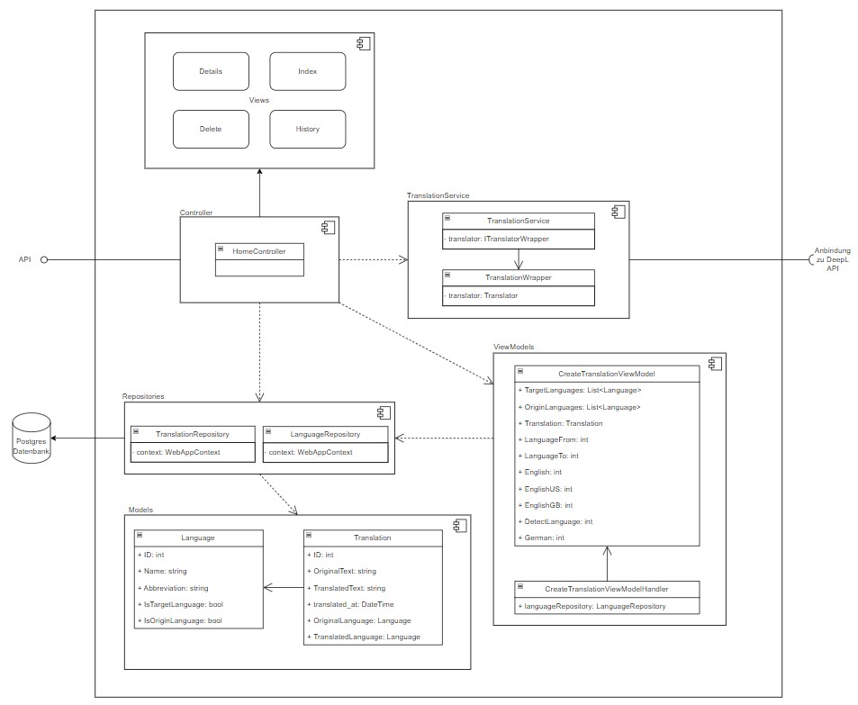

# 

**ARC42 Dokumentation WebApp**

Diese Markdown Datei dient der ARC42 Dokumentation für das SQS-Projekt.

# 1 Einführung und Ziele {#section-introduction-and-goals}

Dieses Dokument beschreibt die Architektur der .NET Core MVC-Anwendung, die als Übersetzer fungiert und die DEEPL-API nutzt. Zusätzlich speichert die Anwendung alle Übersetzungen in einer Datenbank. Dieses Projekt wurde im Rahmen einer Vorlesung an der Hochschule erstellt und wird von meinem Dozenten bewertet.

## 1.1 Aufgabenstellung {#_aufgabenstellung}

Aufgabe it es eine Anwendung zu erstellen. Die Qualität der Software soll professionell abgesichert werden. Die wesentlichsten vorgegebenen Bedingungen für die Umsetzung sind:
- das Verwenden einer externen API
- das Einbinden einer Datenbank
- das Integrieren einer Benutzeroberfläche
 
## 1.2 Qualitätsziele {#_qualit_tsziele}

Die folgend aufgeführten Qualitätsziele nach ISO 25010 sind werden für die Qualitätssicherung der Anwendung herangezogen: 

**Functional Suitability:** Das System bietet Funktionen, die den angegebenen oder implizierten Bedürfnissen entsprechen.
**Security:** Schutz der Systemelemente vor unbeabsichtigtem oder böswilligem Zugriff, Nutzung, Änderung, Zerstörung oder Offenlegung.
**Maintainability:** Das System kann korrekt modifiziert, angepasst oder verbessert werden aufgrund von Veränderungen in der Umgebung oder Anforderungen.
**Operability:** Das System kann von Benutzern verstanden, erlernt, verwendet und als attraktiv empfunden werden.

## 1.3 Stakeholder {#_stakeholder}

| Rolle           | Kontakt                                   | Erwartungshaltung                            |
|:---------------:|:------------------------------------------:|:--------------------------------------------:|
| *Student *      | *simon.goettsberge@stud.th-rosenheim.de*  | *Eigener Lernerfolg*                         | 
| *Dozent*        | *mario-leander.reimer@th-rosenheim.de*    | *Umsetzung einer fundierten und professionellen Software-Qualitätssicherung* |

# 2 Randbedingungen {#section-architecture-constraints}
Die Randbedingungen dieses Projektes werden ausschließlich durch die mündlich kommunizierten Anforderungen bestimmt. Dabei gilt es eine Software zu entwerfen die gezielt entworfen wird. Dabei muss die Software eine externe API, als auch eine Datenbank verwenden. Weitere Details sind alleine dem Studenten überlassen, solange die Software, nach Einschätzung des Dozenten, angemessenen Aufwand qualitätssichernde Maßnahmen genutzt werden. 

# 3 Kontextabgrenzung {#section-system-scope-and-context}

Der User kann in der Applikation Übersetzungen durchführen. Dazu stehen ihm alle Sprachen zur Verfügung die auch DeepL anbietet. Alle durchgeführten Übersetzungen werden in der Datenbank gespeichert. Die gespeicherten Übersetzungen können eingesehen werden. Dabei zeigt sich Ausgangs- und Übersetzungssprache also auch der Original- und Übersetzungstext. Zusätzlich wird auch angezeigt wann die Übersetzung durchgeführt wurde. 

Um die Übersetzungen durchzuführen wird auf die DeepL Api zurückgegriffen.

Die durchgeführten Übersetzungen werden auf einer relationalen Datenbank gespeichert.

## Fachlicher Kontext {#_fachlicher_kontext}

|    Element   |                                                          Description                                                         |
|:------------:|:----------------------------------------------------------------------------------------------------------------------------:|
|     User     | Der User führt Eingaben bezüglich der gewünschten  Sprache und des zu übersetzenden Textes durch.                            |
|    WebApp    | Die .Net Core MVC Web Anwedung nimmt die ausgewählten Parameter entgegen und führt darauf die Übersetzung des Textes durch.  |
| Build System | .Net                                                                                                                         |
|     DeepL    | DeepL ist der externe Übersetzungsdienst der für die tatsächliche Durchführung der Übersetzung verwendet wird.               |
|   Datenbank  | Die verwendete Datenbank speichert die durchgeführten Übersetzungen ab.                                                      |

# 4 Lösungsstrategie {#section-solution-strategy}

.NET Core MVC ist ein leistungsstarkes, quelloffenes Framework, das eine robuste und skalierbare Plattform für die Webentwicklung bietet. Seine modulare Architektur ermöglicht einfache Wartung und Erweiterung. Ein großer Vorteil von .NET Core ist, dass alles in einer Hand liegt: Die gesamte Anwendung besteht aus einem Projekt und muss nicht aus mehreren Projekten zusammengeführt werden, was die Entwicklung beschleunigt, ohne die Qualität zu beeinträchtigen. Außerdem sorgen die plattformübergreifenden Fähigkeiten von .NET Core dafür, dass unsere Anwendung auf verschiedenen Betriebssystemen laufen kann, was entscheidend ist, um ein breiteres Publikum zu erreichen. Das MVC-Muster (Model-View-Controller) gewährleistet eine saubere Trennung der Anliegen, was die Code-Organisation erleichtert und die Wartbarkeit der Anwendung verbessert.

DeepL wird aufgrund seiner überlegenen Übersetzungsqualität ausgewählt, die für die Bereitstellung genauer und natürlicher Übersetzungen entscheidend ist. Die API-Integration von DeepL ist unkompliziert und gut dokumentiert, was eine nahtlose Einbindung in unser System ermöglicht. Durch die Nutzung von DeepL können wir uns auf die Entwicklung der Anwendungslogik und Benutzeroberfläche konzentrieren, anstatt eine eigene Übersetzungsengine entwickeln zu müssen.

Die Verwendung von PostgreSQL bietet zahlreiche Vorteile, darunter hohe Stabilität, Transaktionsunterstützung und eine breite Palette von erweiterten Funktionen für komplexe Datenbankanforderungen. Docker-Container mit PostgreSQL ermöglichen eine flexible und konsistente Umgebungsbereitstellung für Entwicklung, Tests und Bereitstellung, unabhängig von der lokalen Entwicklungsumgebung. Dies fördert eine konsistente Datenbankverwaltung.

# 5 Bausteinsicht {#section-building-block-view}

## 5.1 Ebene 1 Whitebox Gesamtsystem {#_whitebox_gesamtsystem}

Enthaltene Bausteine

|    Element   |                                                          Description                                                         |
|:------------:|:----------------------------------------------------------------------------------------------------------------------------:|
|    WebApp    | Die .Net Core MVC Web Anwedung nimmt die ausgewählten Parameter entgegen und führt darauf die Übersetzung des Textes durch.  |
|     DeepL    | DeepL ist der externe Übersetzungsdienst der für die tatsächliche Durchführung der Übersetzung verwendet wird.               |
|   Datenbank  | Die verwendete Datenbank speichert die durchgeführten Übersetzungen ab.                                                      |

## WebApp
Die Komponente WebApp enhät sämtliche Funktionalitäten unst stellt so das eigentliche Programm dar. Aufgabe dieser Komponente ist das Interagieren mit dem Benutzer über eine Benutzeroberfläche. Zudem ist auch die gesamte Geschäftslogik in dieser Komponente implementiert. Das Aufbereiten, Laden, Speichern und Löschen von Daten wird in dieser Komponente behandelt. Zudem werden auch die Nutzereingaben für die gewünschte Übersetzung an die DeepL API weitergereicht. Die Übersetzung wird entgegengenommen und entsprechend verarbeitet. 

## 5.2 Ebene 2 {#_ebene_2}

Die WebApp Komponente besteht

| Komponente            | Aufgabe                                                                                       |
|-----------------------|-----------------------------------------------------------------------------------------------|
| Views                 | Stellt die Benutzerschnittstelle dar. Hier wird die Interaktion mit dem Benutzer ermöglicht. Diese Komponente ist für die Darstellung der Benutzeroberfläche verantwortlich. Sie zeigt Daten an und nimmt Benutzereingaben entgegen.   |
| Controller            | Der Controller agiert als Vermittler zwischen der Benutzeroberfläche (View) und den Geschäftslogik-Modellen. Er verarbeitet Benutzereingaben und ruft entsprechende Aktionen auf den Modellen oder Repositories auf.      |
| Repositories          | Diese Komponente ist für die Kommunikation mit der Datenbank zuständig. Sie führt CRUD-Operationen (Create, Read, Update, Delete) auf der Postgres-Datenbank durch.        |
| Models                | Modelle repräsentieren die Datenstruktur und enthalten die Daten der Anwendung. Sie sind das zentrale Datenobjekt, mit dem die Anwendung arbeitet.                         |
| TranslationService    | Dieser Dienst ermöglicht die Übersetzung von Texten durch die Anbindung an die externe DeepL API.                                   |
| ViewModel             | Das ViewModel stellt sicher, dass die Daten korrekt zwischen der View und den Modellen gebunden sind.|

## 5.3 Ebene 3 {#_ebene_3}

| Komponente                  | Aufgabe                                                                                                   |
|-----------------------------|-----------------------------------------------------------------------------------------------------------|
| Views                       | Stellt verschiedene Benutzeroberflächen für Details, Index, Delete und History bereit.                    |
| HomeController              | Vermittelt zwischen der Benutzeroberfläche und den Geschäftslogik-Modellen. Verarbeitet Benutzereingaben. |
| TranslationService          | Bietet Übersetzungsdienste durch Anbindung an die DeepL API.                                              |
| TranslationWrapper          | Wrapper für den eigentlichen Übersetzer-Dienst (Translator), um API-Aufrufe zu kapseln.                   |
| Translator                  | Der eigentliche Dienst, der mit der DeepL API kommuniziert und Übersetzungen durchführt.                  |
| TranslationRepository       | Verantwortlich für CRUD-Operationen auf Translation-Entitäten in der Postgres-Datenbank.                  |
| LanguageRepository          | Verantwortlich für CRUD-Operationen auf Language-Entitäten in der Postgres-Datenbank.                     |
| Language                    | Repräsentiert eine Sprache mit Eigenschaften wie Name, Abkürzung und Flags für Ziel- und Ursprungssprache.|
| Translation                 | Repräsentiert eine Übersetzung mit Eigenschaften wie Originaltext, übersetzter Text und Zeitstempel.      |
| CreateTranslationViewModel  | Stellt die Datenbindung für die Erstellung von Übersetzungen bereit.                                      |
| CreateTranslationViewModelHandler | Verantwortlich für die Verarbeitung und Verwaltung von Daten im CreateTranslationViewModel.         |

### 5.3.1 Whitebox Views

Details: Zeigt detaillierte Informationen zu einer bestimmten Entität an.
Index: Listet eine Übersicht von Entitäten auf.
Delete: Ermöglicht das Löschen einer Entität.
History: Zeigt die Historie oder Änderungen von Entitäten an.

### 5.3.2 Whitebox Controller

HomeController steuert die Navigation und Interaktionen auf der Startseite.
Vermittelt zwischen Benutzerinteraktionen und der Geschäftslogik, indem es Anfragen an die entsprechenden Services und Repositories weiterleitet.

### 5.3.3 Whitebox TranslationService

TranslationService: Der Hauptdienst für die Übersetzungslogik. Nutzt den TranslationWrapper zur Kommunikation mit externen APIs.
TranslationWrapper: Kapselt die Logik für den Zugriff auf den Translator-Dienst, um API-Aufrufe zu vereinfachen und zu standardisieren.
Translator: Der konkrete Dienst, der die Übersetzungen durchführt, indem er die DeepL API aufruft.

### 5.3.4 Whitebox Repositories

TranslationRepository: Verwalten der Persistenz von Übersetzungsdaten (Translation-Entitäten) in der Datenbank.
LanguageRepository: Verwalten der Persistenz von Sprachdaten (Language-Entitäten) in der Datenbank.

### 5.3.5 Whitebox Repositories
Language: Datenmodell, das eine Sprache repräsentiert, einschließlich Name, Abkürzung und Flags zur Identifizierung, ob es sich um eine Ziel- oder Ursprungssprache handelt.
Translation: Datenmodell, das eine Übersetzung repräsentiert, einschließlich Originaltext, übersetzter Text, Zeitstempel und Referenzen zu den zugehörigen Sprachen.

### 5.3.6 Whitebox Repositories
CreateTranslationViewModel: Datenmodell für die Erstellung einer neuen Übersetzung. Enthält Listen von Ziel- und Ursprungssprachen sowie Informationen zur Übersetzung.
CreateTranslationViewModelHandler: Verantwortlich für die Verwaltung und Verarbeitung der Daten im CreateTranslationViewModel, einschließlich der Interaktion mit dem LanguageRepository zur Beschaffung von Sprachdaten.

# 6 Laufzeitsicht {#section-runtime-view}

## 6.1 Translation of User Text

Der Prozess beginnt in der View-Schicht, die eine Anfrage zur Erstellung einer neuen Übersetzung an den Controller sendet. Der Controller nimmt die Anfrage entgegen und initiiert den Vorgang, indem er ein Datenmodell zur Erstellung der Übersetzung vorbereitet. Dieses Datenmodell wird an die Verwaltungslogik weitergeleitet, die notwendige Informationen aus den Repositories lädt. Nachdem die Verwaltungslogik die erforderlichen Informationen geholt hat, gibt sie das Modell an den Controller zurück. Der Controller übergibt das Modell an den Übersetzungsdienst, um die eigentliche Übersetzungsarbeit durchzuführen. Der Übersetzungsservice verarbeitet die eingehenden Daten und erstellt die Übersetzung.

Abschließend wird das Ergebnis der Übersetzung an die View-Schicht zurückgegeben, wo es dem Nutzer angezeigt wird.
## 6.2 Laden von einer/mehreren Übersetzung/-en

Zuerst initiiert die View-Komponente die Aktion, indem eine Anfrage an den Controller sendet wird. Der Controller empfängt diese Anfrage und leitet sie an die Repositories weiter, dabei werden je nach Fall eine oder alle Übersetzungen aufgerufen. Sobald die Repositories die benötigte Information bereitgestellt haben, sendet sie eine Antwort an den Controller zurück. Der Controller übermittelt diese Antwort schließlich an die View, was den ursprünglichen Aufruf abschließt und die entsprechende Information an den User ausgibt. Dieses Sequenzdiagramm gilt sowohl für die Bereitstellung einer als auch mehrerer Überstetzungen, da sich der Workflow abgesehen von der Anzahl der geladenen Übersetzungen nicht unterscheidet.

## 6.3 Löschen von Datenbankeinträgen

Zunächst wird eine Anfrage von der View an den Controller gesendet, um eine Übersetzung zu laden. Der Controller übernimmt diese Anfrage und fordert dann die notwendigen Informationen vom Repository an. Nachdem der Controller die Informationen erhalten hat, initiiert er den Löschvorgang der Übersetzung im Repository. Nach erfolgreicher Löschung der Übersetzung wird eine Bestätigung an den Controller zurückgeführt.

# 7 Verteilungssicht {#section-deployment-view}

ASP.NET Core MVC-Anwendungen müssen gehostet werden, um Nutzern über das Internet oder ein Intranet zur Verfügung zu stehen. Es gibt mehrere grundsätzliche Möglichkeiten, diese Anwendungen zu hosten. Eine verbreitete Methode ist die Verwendung von Kestrel, dem integrierten plattformübergreifenden Webserver von ASP.NET Core, der sowohl für Entwicklungs- als auch Produktionsumgebungen geeignet ist. Kestrel kann eigenständig oder hinter einem Reverse-Proxy-Server wie IIS, Nginx oder Apache betrieben werden, um zusätzliche Sicherheit und Skalierbarkeit zu bieten. IIS wird oft in Windows-Umgebungen verwendet, während Nginx und Apache in Linux-Umgebungen beliebt sind. Jede dieser Optionen bietet unterschiedliche Vorteile und Konfigurationsmöglichkeiten, abhängig von den spezifischen Anforderungen und der Infrastruktur der Anwendung.

# 8 Querschnittliche Konzepte {#section-concepts}

In der ASP.NET Core MVC-Anwendung wurden mehrere wichtige Konzepte implementiert, die für die gesamte Architektur und die Qualität der Anwendung relevant sind. Diese Konzepte betreffen verschiedene Teile des Systems und sorgen für Konsistenz, Wartbarkeit und Skalierbarkeit.

## 8.1 MVC-Architektur
Unsere Anwendung folgt dem Model-View-Controller (MVC) Architekturpattern. Die Trennung von Verantwortlichkeiten zwischen Modellen, Views und Controllern erleichtert die Wartung und Weiterentwicklung der Anwendung.

Controller: Die Controller sind für die Verarbeitung der Benutzereingaben verantwortlich, steuern den Anwendungsfluss und interagieren mit den Services. Ein spezifisches Beispiel ist die Nutzung eines externen Übersetzungsdienstes durch den Controller, um sprachspezifische Inhalte dynamisch zu laden.

Modelle: Unsere Modelle enthalten keine Geschäftslogik und dienen ausschließlich dem Datenaustausch. Sie repräsentieren die Struktur unserer Daten und werden für die Interaktion mit der Datenbank und den Views verwendet.

Views: Die Views sind für die Darstellung der Daten verantwortlich. Um eine klare Trennung der Darstellung von der Logik zu gewährleisten, verwenden wir ViewModels und ViewModelHandler. ViewModels enthalten die Daten, die eine View benötigt, und ViewModelHandler sind für die Erstellung und Verwaltung dieser ViewModels zuständig.

## 8.2 Datenzugriff und Repositories
Für den Zugriff auf die Datenbank nutzen wir das Repository Pattern. Repositories bieten eine Abstraktionsschicht über den Datenzugriff und ermöglichen es uns, die Datenbankoperationen zentral zu verwalten. Dies trägt zu einer sauberen Trennung der Geschäftslogik und der Datenzugriffsschicht bei und erleichtert die Wartung und das Testen der Anwendung.

## 8.3 Sprachverwaltung und Seeding
Bei jedem Programmstart werden die verfügbaren Sprachen in der Datenbank mittels eines Seeding-Prozesses aktualisiert. Dies stellt sicher, dass die Anwendung stets die aktuellen Sprachdaten zur Verfügung hat und erleichtert die Verwaltung der Lokalisierung. Der Seeding-Prozess überprüft und aktualisiert die in der Datenbank gespeicherten Sprachinformationen, um sicherzustellen, dass alle unterstützten Sprachen korrekt und aktuell sind.

# 9 Architekturentscheidungen {#section-design-decisions}

## 9.1 ADR 1: Implementierung der Webanwendung mit ASP.Net Core MVC

| **Section**   | **Description**                                                                                                                                              |
|---------------|--------------------------------------------------------------------------------------------------------------------------------------------------------------|
| **Title**     | Implementierung der Webanwendung mit ASP.Net Core MVC                                                                                                |
| **Context**   | Die Entscheidung betrifft die Auswahl der Entwicklungsplattform für unsere Webanwendung. Wir stehen vor verschiedenen technischen und politischen Herausforderungen. **Technischer Kontext**:<ul><li>ASP.Net Core MVC bietet eine moderne und flexible Plattform für die Entwicklung plattformübergreifender Webanwendungen.</li><li>Die Architektur von MVC (Model-View-Controller) ermöglicht eine klare Trennung von Datenmodellen, Benutzeroberfläche und Geschäftslogik.</li><li>Der durchgängige Technologiestack von UI bis zur Datenbankanbindung minimiert Kompatibilitätsprobleme und erleichtert die Integration.</li></ul> **Politische Aspekte**:<ul><li>Entwickler verfügen über Erfahrung mit der MVC-Architektur, insbesondere mit Laravel, was die Einarbeitung in ASP.Net Core MVC erleichtert.</li><li>Die Verwendung der etablierten Programmiersprache C# bietet Vorteile in Bezug auf Produktivität und Codequalität.</li><li>Microsoft bietet umfangreiche Dokumentation, Tooling in Visual Studio IDE und Erweiterungen für Visual Studio Code, was die Entwicklung unterstützt.</li><li>C# und die Unterstützung durch Entity Framework Core und MSTest bieten eine robuste Plattform für die Entwicklung und Wartung der Anwendung.</li></ul>|
| **Decision**  | Es wurde entschieden, die Webanwendung mit ASP.Net Core MVC zu implementieren, um von den technischen Vorteilen der Plattform und der vorhandenen Entwicklererfahrung zu profitieren. |
| **Status**    | Akzeptiert                                                                                                                                                   |
| **Consequences** | **Positive Konsequenzen**: <ul><li>Strukturierte Architektur durch die Nutzung von MVC.</li><li>Integrierter Technologiestack von UI bis Datenbankanbindung.</li><li>Unterstützung durch umfangreiche Microsoft-Dokumentation und Tools.</li><li>Verwendung einer etablierten Programmiersprache (C#).</li></ul>  **Negative Konsequenzen**: <ul><li>Möglicherweise steilere Lernkurve für Entwickler ohne direkte Erfahrung mit ASP.Net Core MVC.</li><li>Abhängigkeit von der Weiterentwicklung und Unterstützung durch Microsoft.</li></ul>  **Neutrale Konsequenzen**: <ul><li>Keine spezifischen neutralen Konsequenzen identifiziert.</li></ul> |

## 9.2 ADR 2: Verwendung von DeepL als externer Übersetzungsdienst

| **Section**       | **Description**                                                                                                                                                                      |
|-------------------|--------------------------------------------------------------------------------------------------------------------------------------------------------------------------------------|
| **Title**         | ADR 2: Verwendung von DeepL als externer Übersetzungsdienst                                                                                                                          |
| **Context**       | Die Entscheidung betrifft die Auswahl eines externen Übersetzungsdienstes für unsere Webanwendung. Es gibt verschiedene technische und praktische Erwägungen: **Technischer Kontext**:<ul><li> Die Webanwendung erfordert die Übersetzung von Texten in verschiedene Sprachen</li><li>Der Übersetzungsdienst muss eine hohe Übersetzungsqualität und Zuverlässigkeit bieten.</li><li>Eine einfache und gut dokumentierte API ist erforderlich, um die Integration in die Architektur zu erleichtern.</li></ul> **Praktische Erwägungen**:<ul><li>DeepL bietet eine der besten Übersetzungsqualitäten auf dem Markt und wird oft für seine Genauigkeit und Natürlichkeit der Übersetzungen gelobt.</li><li>Die DeepL ist bis 500.000 zu übersetzenden Zeichen kostenlos</li><li>DeepL bietet umfassende Dokumentation und SDKs für verschiedene Programmiersprachen, einschließlich C#, was die Integration in die ASP.Net Core MVC-Anwendung erleichtert.</li></ul>|
| **Decision**      | Es wurde entschieden, DeepL als externen Übersetzungsdienst zu verwenden, um von der hohen Übersetzungsqualität und der einfachen Integration zu profitieren.                         |
| **Status**        | Akzeptiert                                                                                                                                                                           |
| **Consequences**  | **Positive Konsequenzen**: <ul><li>Hochwertige und natürliche Übersetzungen, die die Benutzererfahrung verbessern.</li><li>Einfache Integration dank gut dokumentierter API und SDKs.</li><li>Flexibles Preismodell, das sich an den Nutzungsbedarf anpasst.</li><li>Reduzierte Entwicklungszeit durch vorhandene Entwicklererfahrung mit API-Integration.</li></ul>  **Negative Konsequenzen**: <ul><li>Abhängigkeit von einem externen Dienstleister, was bei Ausfällen oder Änderungen im Dienst zu Problemen führen kann.</li><li>Kosten für die Nutzung des Dienstes, die sich je nach Nutzungsvolumen erhöhen können.</li>  **Neutrale Konsequenzen**: <ul><li>Keine spezifischen neutralen Konsequenzen identifiziert.</li></ul> |

## 9.3 ADR 3: Verwendung von PostgreSQL als Datenbank

| **Section**       | **Description**                                                                                                                                                                           |
|-------------------|-------------------------------------------------------------------------------------------------------------------------------------------------------------------------------------------|
| **Title**         | ADR 4: Verwendung von PostgreSQL als Datenbank                                                                                                                                           |
| **Context**       | Diese Entscheidung betrifft die Auswahl der Datenbank für die Webanwendung. Es gibt verschiedene technische und praktische Erwägungen: **Technischer Kontext**:<ul><li>Die Anwendung benötigt eine robuste und leistungsfähige Datenbank, die komplexe Abfragen und Transaktionen effizient verarbeiten kann.</li><li></li><li>PostgreSQL ist eine hochgradig anpassbare und erweiterbare relationale Datenbank, die eine Vielzahl von Datentypen und Funktionen unterstützt.</li><li>Die Datenbank muss skalierbar sein, um mit wachsendem Datenvolumen und steigenden Nutzerzahlen Schritt zu halten.</li></ul> **Praktische Erwägungen**:<ul><li>Entwickler haben Erfahrung mit PostgreSQL, was die Einarbeitungszeit und Implementierungsdauer reduziert.</li><li>PostgreSQL ist Open Source und bietet ein hervorragendes Preis-Leistungs-Verhältnis im Vergleich zu kommerziellen Datenbanklösungen.</li><li>Die Community-Unterstützung und die umfangreiche Dokumentation zu PostgreSQL erleichtern die Lösung von Problemen und die Implementierung von Best Practices.</li><li>PostgreSQL bietet starke Sicherheitsfunktionen und Tools zur Datenbankverwaltung, die für den Betrieb und die Wartung der Anwendung wichtig sind.</li></ul>|
| **Decision**      | Die Wahl fiel auf PostgreSQL als Datenbank, um von der Leistungsfähigkeit, Flexibilität und den praktischen Vorteilen einer etablierten Open-Source-Lösung zu profitieren.                 |
| **Status**        | Akzeptiert                                                                                                                                                                               |
| **Consequences**  | **Positive Konsequenzen**: <ul><li>Robuste und leistungsfähige Datenbanklösung, die komplexe Abfragen und Transaktionen unterstützt.</li><li>Geringere Kosten durch die Verwendung einer Open-Source-Lösung.</li><li>Skalierbarkeit zur Bewältigung von wachsendem Datenvolumen und Nutzerzahlen.</li><li>Starke Sicherheitsfunktionen und umfangreiche Verwaltungswerkzeuge.</li></ul>  **Negative Konsequenzen**: <ul><li>Abhängigkeit von Community-Support, was in seltenen Fällen zu längeren Lösungszeiten bei spezifischen Problemen führen kann.</li><li>Initiale Konfigurations- und Optimierungsaufwände können höher sein als bei einigen kommerziellen Datenbanklösungen.</li>  **Neutrale Konsequenzen**: <ul><li>Keine spezifischen neutralen Konsequenzen identifiziert.</li></ul> |

# 10 Qualitätsanforderungen {#section-quality-scenarios}

## 10.1 Wartbarkeit (Maintainability)
Die Anwendung muss so gestaltet sein, dass sie leicht zu warten und zu erweitern ist. Dies umfasst die Möglichkeit, Komponenten einfach zu ersetzen oder zu aktualisieren, ohne dass dies die Funktionalität der gesamten Anwendung beeinträchtigt. Zum Beispiel sollten Teile außerhalb des Messbereichs ohne Auswirkungen auf die korrekten Messungen innerhalb des Messbereichs ausgetauscht werden können. Eine klare und gut strukturierte Codebasis sowie umfangreiche Dokumentation sind ebenfalls entscheidend, um die Wartung zu erleichtern und sicherzustellen, dass neue Entwickler schnell in das Projekt einsteigen können.

## 10.2 Sicherheit (Security)
Sicherheit ist ein zentrales Qualitätsziel der Anwendung. Es müssen umfassende Sicherheitsmechanismen implementiert werden, um die Integrität der Daten und die Authentizität der Komponenten zu gewährleisten. Dies schließt die Prüfung von Abhängigkeiten ein, um sicherzustellen, dass alle verwendeten Bibliotheken und Module sicher sind und keine bekannten Sicherheitslücken enthalten.

## 10.3 Funktionale Eignung (Functional Suitability)
Die Anwendung muss alle spezifizierten Anforderungen und Funktionen korrekt und zuverlässig erfüllen. Für den Übersetzungsdienst bedeutet dies, dass die unterstützten Sprachen der DeepL API korrekt gespeichert und verwendet werden. Jede Komponente der Anwendung muss tiefgehend auf ihre Funktionalität geprüft werden, um sicherzustellen, dass sie ordnungsgemäß und erwartungsgemäß funktioniert. Die Anwendung muss unter verschiedenen Betriebsbedingungen robust arbeiten und dabei eine hohe Präzision und Zuverlässigkeit bieten. Darüber hinaus sollte die Benutzeroberfläche so gestaltet sein, dass sie intuitiv und leicht zu erlernen ist, um den Benutzern eine optimale Nutzung zu ermöglichen.

# 11 Risiken und technische Schulden {#section-technical-risks}

## 11.1 Technical Risks

| Risk                                | Description                                                                                                 |
|-------------------------------------|-------------------------------------------------------------------------------------------------------------|
| Sicherheitslücken bei der API-Nutzung | Die Nutzung des externen Übersetzungsdienstes könnte Sicherheitslücken aufweisen, wenn die API nicht korrekt gesichert ist. |
| Mangelnde Entwicklererfahrung        | Die mangelnde Erfahrung des Entwicklers mit der Integration und Nutzung des DeepL Übersetzungsdienstes kann zu Fehlern führen. Weitaus stärker wirkt sich mangelnde Erfahrung bei der Entwicklung der Anwendung mit ASP.NET aus |
| Übersetzungskontingent zu gering     | Das verfügbare Übersetzungskontingent von DeepL könnte zu gering sein, was den Dienst unbrauchbar macht oder zusätzliche Kosten verursacht. |
| API-Änderungen                       | Änderungen an der DeepL API könnten die Funktionalität beeinträchtigen, wenn die Anwendung nicht zeitnah angepasst wird. |
| Datenintegrität und -sicherheit      | Es besteht das Risiko, dass die übersetzten Daten nicht sicher übertragen oder gespeichert werden, was zu Datenschutzverletzungen führen könnte. |
| Abhängigkeit von externem Dienst     | Eine starke Abhängigkeit von DeepL könnte problematisch sein, wenn der Dienst ausfällt oder eingestellt wird. |

## 11.2 Business or Domain Risks

| Risk                                  | Description                                                                                                    |
|---------------------------------------|----------------------------------------------------------------------------------------------------------------|
| Abhängigkeit von DeepL                | Eine starke Abhängigkeit von DeepL kann zu Problemen führen, wenn der Dienst teurer wird oder die Geschäftsbedingungen sich ändern. |
| Regulatorische Anforderungen          | Es besteht das Risiko, dass die Nutzung eines externen Übersetzungsdienstes regulatorische Anforderungen nicht erfüllt. |
